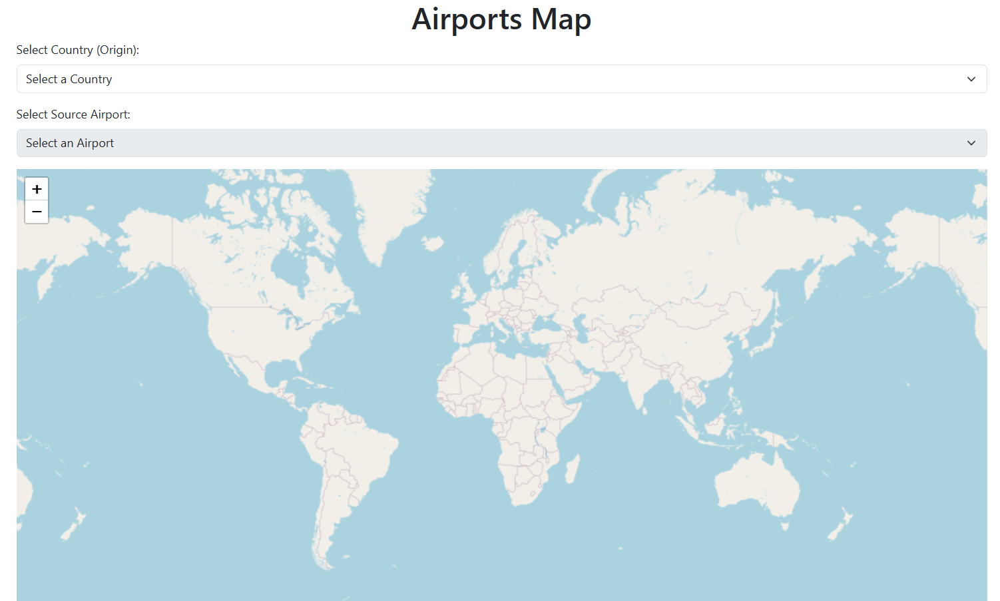
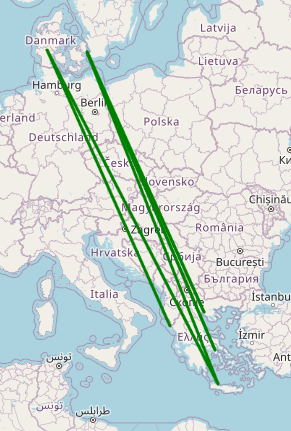
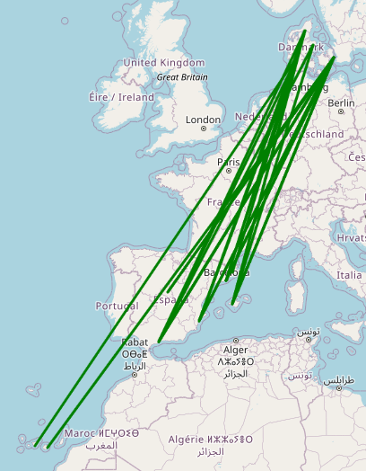
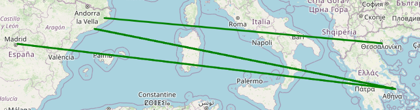

# ✈️ Flight Routes API Project

This is the third project from the 610-hour Data Science course at diCampus, where we developed an API displaying all 2013 flights between countries and airports( [**database**]([https://github.com/tu-usuario/chess-gender-comparison-api](https://openflights.org/data.php))), making it easier to analyze the best routes — a feature that is often hard to find on major flight websites.

# 📚 Project Overview

The objective of this project was to create an API that reveals all flight routes between countries and airports in 2013, supporting better route analysis and planning.

Example Visualization: The images shows flights between Spain, Denmark, and Greece. Only three routes exist between Spain and Greece, whereas many more flights connect Spain to Denmark. This suggests that international flights to Spain primarily originate from high-income countries, focusing on tourism in the Mediterranean and the Balearic and Canary Islands.

# 🔧 Technical Details

## Backend
The backend of the API is built using Python’s Flask library, handling the routing and managing connections with MongoDB, a NoSQL database that stores data in JSON format.
MongoDB was chosen for its suitability for large volumes of unstructured data.
The connection between Flask and MongoDB is facilitated by MongoClient, making it efficient to access and manage the database from Python.
## Frontend
For the frontend, I developed an interactive user interface with HTML and Bootstrap. Dropdown menus enable users to select specific countries and airports.
Leaflet.js powers the dynamic map visualization, allowing users to see flight routes in real time.
