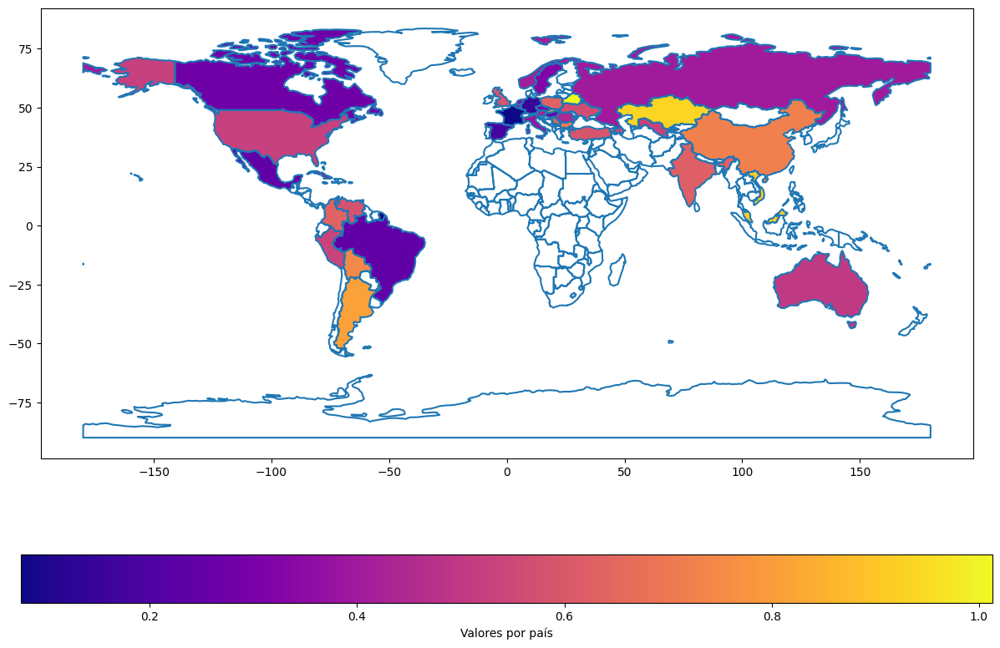

# 📊 Analysis of Gender Influence on Female Athletes' Performance in Chess

## Project Overview
This project explores the question: Does European society influence the performance of female athletes? Unlike physical sports where men and women often compete separately due to physiological differences, chess is a mental game where, theoretically, gender should have no impact on performance. However, the top ranks in competitive chess are overwhelmingly male. The only woman to have reached the elite level of male chess competition was Judit Polgar, who achieved this with unique, home-based training and by avoiding women-only tournaments.

## Study Details
I conducted an analysis of the average number of women in the top 10 national ELO (FIDE chess rating) rankings for countries with significant chess participation, focusing on players born between 1999 and 2006 to study younger generations. Using 2020 ELO data (pre-pandemic), the hypothesis is that gender does not inherently affect chess skill. If fewer women are found in top rankings, this might stem from lower female representation. I then normalized this average by the percentage of women with ELO ratings above 1300, which is represented by the lower bar in the attached graph.

## Key Findings
In the graph:

- A value near 1 indicates that player performance is independent of gender.
- Values closer to zero suggest a trend where men outperform women on average.

Interestingly, countries like France, Spain, and Germany showed low values (0.1-0.2), with only one woman in the top 10 approximately every five years. In contrast, Belarus, Kazakhstan, Malaysia, Vietnam, Iran, and China have values closer to 1 (0.9-1). In Vietnam and China, for example, there are consistently 2-3 women in the national top 10 each generation.

## Conclusions
The data shows an interesting result on gender equality across continents. This study suggests that societal factors may play a key role in shaping the success of female athletes in intellectual competitions like chess.

