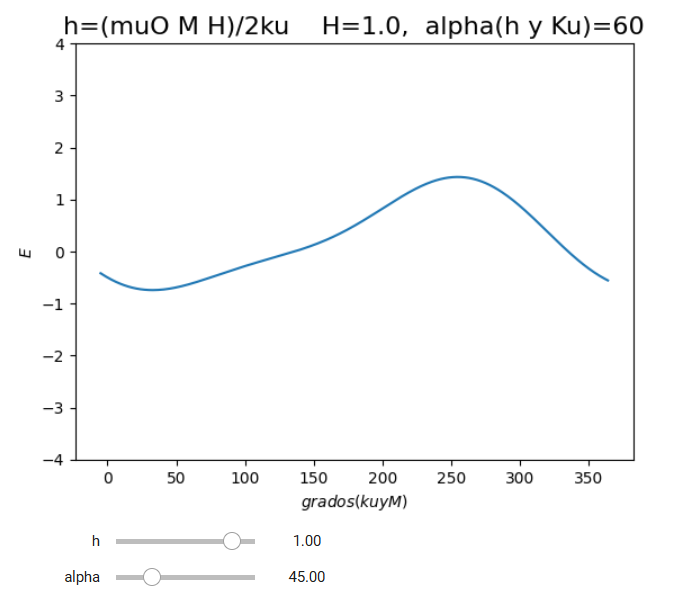

# Pablo-Portfolio

Welcome to my portfolio! I am Pablo Rodríguez, a research scientist with over 2 years of experience in Parma, Italy, and San Sebastián, Spain. I am enthusiastic about advancing my career in Data Science or Data Engineering.

My core skills include data processing (MySQL, Pandas, MongoDB), machine learning (Scikit-learn, TensorFlow), and natural language processing (NLTK). I’m skilled in data extraction (Beautiful Soup, Selenium) and API development (Flask, FastAPI, Django). The projects in this portfolio showcase these abilities, reflecting my commitment to data science and engineering.

## 📚 Academic projects

This section includes a collection of academic projects completed during Data Science course of 610 hours in diCampus. Each project demonstrates different aspects of data science and machine learning, covering the entire data life cycle—from data extraction and cleaning to modeling and result visualization. These projects are fully documented and come with code to enable reproducibility and further exploration.

1. [**♟️ Chess Gender Comparison API**](https://github.com/tu-usuario/chess-gender-comparison-api)  
   My first Data Science project and the most interesting result from my Linkedin publications. I analized the gender equality at the top national list of chess players per year of birth. The project shows an interesting result on gender equality across continents.

2. [**Fraud Detection project**](https://github.com/tu-usuario/proyecto-2)  
   This project focueses on fraud detection using a logistic regression model, chosen for its simplicity and interpretability over more complex models like neural networks. The primary goal is to evaluate the model's performance through sensitivity and specificity scores.

   Comparing models may seem straightforward, but there's still a significant element of art in tailoring the data, making it challenging to know if perfection was achieved. Sot his project shows the importance of treating the model as best as possible, and for that, it is necessary to understand it well and the situation it is in, making data science a field with many possible solutions.
   
3. [**Investment Asset Management System**](https://github.com/tu-usuario/proyecto-3)  
   This project stores the information of each on its clients, who will have their assets invested in one or more types of investements(stocks of other companies, bonds and bank deposits), in an Entity-Relationship Diagram(ERD) with SQL for a bank.

4. [**✈️ Api flights between countries**](https://github.com/tu-usuario/proyecto-3)  
   The aim of this project was to create an API that reveals all flight routes between countries and airports in 2013 from a MongoDB dataset, supporting better route analysis and planning.

   There are some interesting results that could show the different economies situations between European countries that affects the flight system.

5. [**🐦 Sentiment Analysis in tweets about the coach of a football team**](https://github.com/tu-usuario/proyecto-3)  
   This project aims to analyse the reaction of followers on the Twitter platform regarding sports results and which opinions have the greatest weight in society. This project can be optimized with very high expectations using some magnetism models that I studied during my research stage.

6. [**🛒 Shopping Cart System with Object-Oriented Programming**](https://github.com/tu-usuario/proyecto-3)  
   A shopping system that, given a set of products, allow us to add them to a shopping cart with Object-Oriented Programming.
 
## 🧪 Research Projects

This section highlights some of the research projects I conducted as a researcher. Each project applied advanced data science and modeling techniques to complex problems in physics and material sciences. While code and specific datasets are not publicly available due to confidentiality agreements, the following descriptions outline the objectives, methodologies, and general outcomes of each project.

1- Stoner-Wohlfarth Magnetism Model.

This project involved the study and application of the Stoner-Wohlfarth model, a foundational theory in magnetism used to understand the magnetic properties of single-domain particles. I explored how this model explains hysteresis and magnetic reversal, crucial for applications in data storage and magnetic sensors. Through data-driven modeling, I aimed to enhance the understanding of how external magnetic fields influence material properties at a microscopic level.

2- Magneto-Optic Transfer Matrix with Matthias Schubert’s Methods

In this project, I employed the magneto-optic transfer matrix technique developed by Dr. Matthias Schubert to analyze the optical response of magnetized materials. This method allowed for precise modeling of how electromagnetic waves interact with magnetic media, facilitating insights into material properties and enabling advancements in magnetic photonic device development. The transfer matrix approach, combined with spectroscopic data, provided a robust framework to study material responses to different light polarizations and incident angles.

3- Localized Surface Plasmon Resonance (LSPR) and Surface Lattice Resonance in Nanostructured Spheres

This project focused on modeling the optical properties of nanostructured spheres using LSPR and Surface Lattice Resonance (SLR) phenomena. By examining how nanoparticles resonate at certain frequencies of light, the research contributed to the development of novel plasmonic devices with applications in sensing, photonic circuitry, and biomedical devices. Using advanced data analysis methods, I studied how particle arrangement, size, and material properties affect the resonance behavior, providing insights for designing highly sensitive plasmonic sensors.

Each of these projects was developed entirely from scratch, reflecting my commitment to creating custom, fully original solutions rather than refining existing code. This approach enabled complete control over model parameters, ensuring precision and innovation in each project.

## Contacto

For more information about any project, feel free to contact me at:
- [LinkedIn](https://linkedin.com/in/tu-usuario)
- [Correo electrónico](mailto:tu-email@gmail.com)

