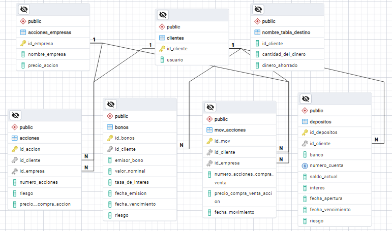

# 📊 Investment Asset Management System for Banco Mangander

This project involves designing an Entity-Relationship Diagram (ERD) for Banco Mangander, an investment firm managing diverse financial assets across multiple clients. The system must store detailed information for each client and their holdings, which include stocks, bonds, and bank deposits. Each asset type has unique attributes and must support transactions, market valuation history, and risk categorization (e.g., high-risk, short-term). The ERD will capture these requirements, including entity relationships, cardinalities, and inheritance for asset subtypes where appropriate.

